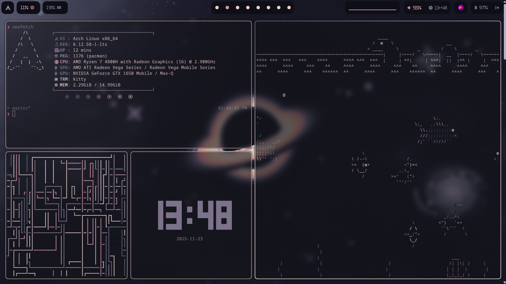
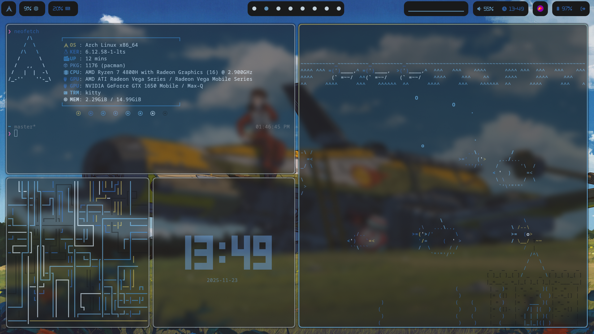
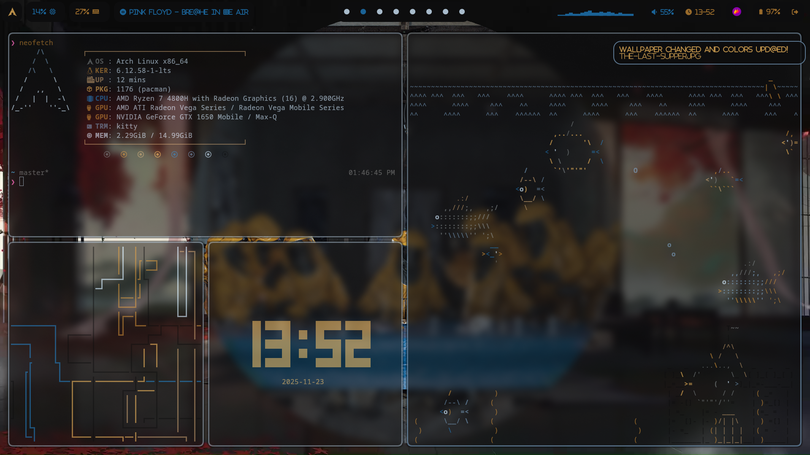
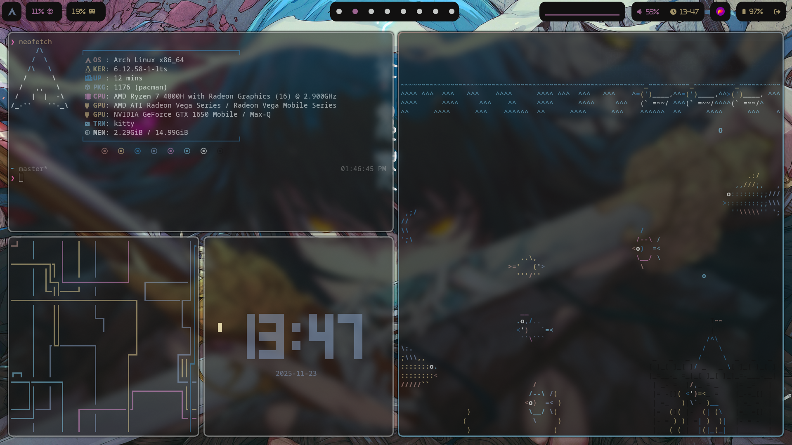

A glimpse as of now ->

&&

&&

&&

&&

All pkg && aur list in imp-settings folder after installing and git cloning use restore.sh script.......

Note:- 
1). To use dunst pywal integration symlink the dunstrc at wal to at that of .config
i.e ln -sf ~/.cache/wal/dunstrc ~/.config/dunst/dunstrc
